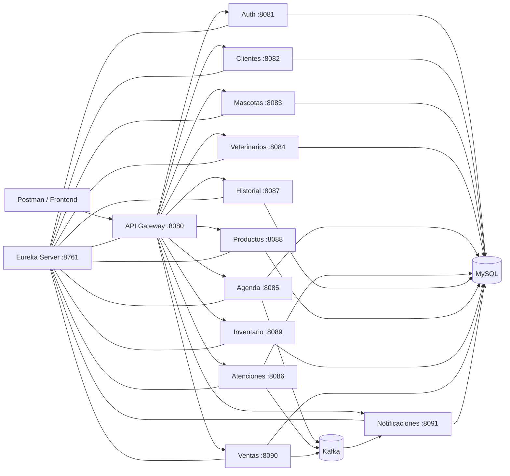

# VetControl Microservices

Backend distribuido para la gestión de una clínica veterinaria y pet shop, desarrollado con **Java, Spring Boot y una arquitectura de microservicios**.

VetControl permite administrar clientes, mascotas, veterinarios, citas, atenciones clínicas, historiales, productos, inventario, ventas, usuarios y notificaciones.

El proyecto incorpora autenticación mediante JWT, descubrimiento de servicios con Eureka, comunicación entre microservicios con OpenFeign, eventos asincrónicos con Kafka y ejecución mediante Docker Compose.

---

## Tabla de contenidos

* [Objetivo](#objetivo)
* [Arquitectura](#arquitectura)
* [Tecnologías](#tecnologías)
* [Microservicios](#microservicios)
* [Comunicación entre servicios](#comunicación-entre-servicios)
* [Seguridad](#seguridad)
* [Bases de datos](#bases-de-datos)
* [Requisitos](#requisitos)
* [Configuración inicial](#configuración-inicial)
* [Ejecución con Docker](#ejecución-con-docker)
* [Verificación del sistema](#verificación-del-sistema)
* [Credenciales de demostración](#credenciales-de-demostración)
* [Pruebas con Postman](#pruebas-con-postman)
* [Rutas principales](#rutas-principales)
* [Pruebas automatizadas](#pruebas-automatizadas)
* [Estructura del repositorio](#estructura-del-repositorio)
* [Problemas frecuentes](#problemas-frecuentes)
* [Documentación adicional](#documentación-adicional)

---

## Objetivo

VetControl busca representar una solución backend modular para una clínica veterinaria y una tienda de productos para mascotas.

La arquitectura divide las responsabilidades del sistema en servicios independientes, evitando concentrar toda la aplicación en un único proyecto.

Con esta solución se demuestra:

* Separación de responsabilidades por dominio.
* Uso de API Gateway como punto único de entrada.
* Descubrimiento de servicios mediante Eureka.
* Autenticación y autorización mediante JWT.
* Comunicación sincrónica con OpenFeign.
* Comunicación asincrónica mediante Apache Kafka.
* Base de datos independiente por microservicio.
* Pruebas unitarias y de integración.
* Contenerización y ejecución mediante Docker.
* Documentación y pruebas manuales mediante Postman.

---

## Arquitectura



Todos los accesos externos deben realizarse preferentemente mediante:

```text
http://localhost:8080
```

El API Gateway localiza los servicios registrados en Eureka y redirige cada solicitud al microservicio correspondiente.

La explicación completa se encuentra en:

```text
docs/arquitectura.md
```

---

## Tecnologías

| Categoría                | Tecnología                    |
| ------------------------ | ----------------------------- |
| Lenguaje                 | Java 17                       |
| Framework                | Spring Boot 3.2.5             |
| Microservicios           | Spring Cloud 2023.0.1         |
| API Gateway              | Spring Cloud Gateway          |
| Service Discovery        | Netflix Eureka                |
| Seguridad                | Spring Security, JWT y BCrypt |
| Persistencia             | Spring Data JPA e Hibernate   |
| Base de datos            | MySQL 8                       |
| Migraciones              | Flyway                        |
| Comunicación sincrónica  | REST y OpenFeign              |
| Comunicación asincrónica | Apache Kafka                  |
| Coordinación Kafka       | Zookeeper                     |
| Documentación API        | Springdoc OpenAPI / Swagger   |
| Estado de aplicaciones   | Spring Boot Actuator          |
| Pruebas                  | JUnit 5 y Mockito             |
| Construcción             | Maven                         |
| Contenedores             | Docker y Docker Compose       |
| Pruebas manuales         | Postman                       |

---

## Microservicios

| Servicio               | Puerto | Responsabilidad                            |
| ---------------------- | -----: | ------------------------------------------ |
| `eureka-server`        |   8761 | Registro y descubrimiento de servicios     |
| `api-gateway`          |   8080 | Punto único de entrada y validación JWT    |
| `auth-service`         |   8081 | Login, usuarios, roles y generación de JWT |
| `cliente-service`      |   8082 | Gestión de clientes                        |
| `mascota-service`      |   8083 | Gestión de mascotas                        |
| `veterinario-service`  |   8084 | Gestión de veterinarios                    |
| `agenda-service`       |   8085 | Gestión de citas                           |
| `atencion-service`     |   8086 | Registro de atenciones clínicas            |
| `historial-service`    |   8087 | Gestión del historial clínico              |
| `producto-service`     |   8088 | Gestión de productos                       |
| `inventario-service`   |   8089 | Control de stock                           |
| `venta-service`        |   8090 | Registro de ventas                         |
| `notificacion-service` |   8091 | Notificaciones generadas por eventos       |

---

## Comunicación entre servicios

### Comunicación sincrónica

OpenFeign permite realizar validaciones inmediatas entre microservicios.

Ejemplos:

* `mascota-service` valida que el cliente exista.
* `agenda-service` valida la mascota y el veterinario.
* `venta-service` valida el cliente, los productos y el inventario.
* `atencion-service` trabaja con datos relacionados con citas y mascotas.

### Comunicación asincrónica

Kafka permite publicar eventos sin bloquear la operación principal.

Eventos principales:

```text
cita-creada
atencion-registrada
venta-creada
```

El servicio de notificaciones puede consumir estos eventos y registrar los avisos correspondientes.

---

## Seguridad

El sistema usa autenticación mediante JSON Web Token.

Flujo:

1. El usuario envía sus credenciales a `auth-service`.
2. El servicio valida las credenciales.
3. Se genera un token JWT.
4. El usuario envía el token en las solicitudes posteriores.
5. API Gateway valida la firma, vigencia y rol.
6. Los microservicios procesan la operación autorizada.

Encabezado requerido:

```http
Authorization: Bearer TOKEN_GENERADO
```

Roles principales:

```text
ADMIN
RECEPCIONISTA
VETERINARIO
```

Respuestas esperadas:

| Situación                    |         Código |
| ---------------------------- | -------------: |
| Petición correcta            | 200, 201 o 204 |
| Token inexistente o inválido |            401 |
| Usuario sin permisos         |            403 |
| Recurso inexistente          |            404 |
| Datos inválidos              |            400 |

---

## Bases de datos

VetControl aplica el patrón **base de datos por servicio**.

El entorno local utiliza un contenedor MySQL con los siguientes esquemas:

```text
vetcontrol_auth
vetcontrol_clientes
vetcontrol_mascotas
vetcontrol_veterinarios
vetcontrol_agenda
vetcontrol_atenciones
vetcontrol_historial
vetcontrol_productos
vetcontrol_inventario
vetcontrol_ventas
vetcontrol_notificaciones
```

Los microservicios no deben consultar directamente las tablas pertenecientes a otros servicios.

### Conexión desde Windows

```text
Host: localhost
Puerto: 3307
Usuario: vetcontrol
```

### Conexión entre contenedores

```text
Host: mysql
Puerto: 3306
```

El puerto `3307` se utiliza desde Windows para evitar conflictos con instalaciones locales como XAMPP.

---

## Requisitos

Para ejecutar el sistema mediante Docker se necesita:

* Git.
* Docker Desktop.
* Docker Compose.
* Postman.
* Conexión a Internet durante la primera construcción.

IntelliJ IDEA y Java pueden utilizarse para revisar o ejecutar el proyecto fuera de Docker, pero no son obligatorios para iniciar los contenedores.

### Recursos recomendados

Para ejecutar todos los microservicios simultáneamente se recomienda:

* 16 GB de RAM total en el computador.
* Al menos 6 GB disponibles para Docker.
* Cerrar aplicaciones que consuman demasiada memoria.

En equipos con menos recursos, los servicios pueden ejecutarse por grupos.

---

## Configuración inicial

### 1. Clonar el repositorio

```powershell
git clone URL_DEL_REPOSITORIO
cd vetcontrol-microservices
```

### 2. Crear el archivo de variables de entorno

El archivo `.env` contiene configuraciones locales y no debe subirse a GitHub.

En PowerShell:

```powershell
Copy-Item .env.example .env
```

Variables principales:

```env
MYSQL_ROOT_PASSWORD=root
MYSQL_USER=vetcontrol
MYSQL_PASSWORD=vetcontrol123

JWT_SECRET=CAMBIAR_POR_UNA_CLAVE_SEGURA

ADMIN_PASSWORD=admin123
RECEPCION_PASSWORD=recepcion123
VETERINARIO_PASSWORD=vet123
```

### 3. Validar Docker Compose

Abrir Docker Desktop y esperar hasta que indique:

```text
Engine running
```

Después ejecutar:

```powershell
docker version
docker compose version
docker info
docker compose config
```

---

## Ejecución con Docker

### Primera ejecución en un computador con recursos suficientes

```powershell
docker compose up -d --build
```

Este comando construye las imágenes e inicia los contenedores.

La primera construcción puede tardar varios minutos debido a la descarga de dependencias Maven e imágenes Docker.

### Inicio posterior sin reconstrucción

```powershell
docker compose up -d
```

### Ejecución ordenada por grupos

#### Infraestructura

```powershell
docker compose up -d mysql zookeeper kafka
```

Comprobar:

```powershell
docker compose ps
```

MySQL y Kafka deben aparecer como:

```text
healthy
```

#### Servicios centrales

```powershell
docker compose up -d eureka-server auth-service api-gateway
```

#### Dominio clínico

```powershell
docker compose up -d cliente-service mascota-service veterinario-service
docker compose up -d agenda-service atencion-service historial-service
```

#### Dominio comercial

```powershell
docker compose up -d producto-service inventario-service
docker compose up -d venta-service notificacion-service
```

### Construir un solo microservicio

El proyecto usa un Dockerfile genérico ubicado en la raíz.

Ejemplo:

```powershell
docker build `
  --build-arg MODULE=cliente-service `
  -t vetcontrol-cliente-service .
```

Después puede iniciarse mediante:

```powershell
docker compose up -d --no-deps cliente-service
```

Esto permite reutilizar el mismo Dockerfile para todos los módulos y evita mantener múltiples archivos prácticamente idénticos.

### Detener los contenedores

```powershell
docker compose stop
```

También se puede utilizar:

```powershell
docker compose down
```

No ejecutar salvo que se desee eliminar los datos:

```powershell
docker compose down -v
```

La opción `-v` elimina los volúmenes, incluyendo los datos almacenados en MySQL.

---

## Verificación del sistema

### Estado de los contenedores

```powershell
docker compose ps -a
```

### Registros de un servicio

```powershell
docker compose logs --tail=150 api-gateway
```

### Healthchecks

Cada aplicación expone:

```text
/actuator/health
```

Ejemplos:

```text
http://localhost:8080/actuator/health
http://localhost:8081/actuator/health
http://localhost:8082/actuator/health
http://localhost:8083/actuator/health
http://localhost:8084/actuator/health
http://localhost:8085/actuator/health
http://localhost:8086/actuator/health
http://localhost:8087/actuator/health
http://localhost:8088/actuator/health
http://localhost:8089/actuator/health
http://localhost:8090/actuator/health
http://localhost:8091/actuator/health
```

Respuesta esperada:

```json
{
  "status": "UP"
}
```

### Eureka Server

```text
http://localhost:8761
```

Los microservicios iniciados deben aparecer registrados con estado:

```text
UP
```

---

## Credenciales de demostración

| Usuario     | Contraseña     | Rol             |
| ----------- | -------------- | --------------- |
| `admin`     | `admin123`     | `ADMIN`         |
| `recepcion` | `recepcion123` | `RECEPCIONISTA` |
| `vet`       | `vet123`       | `VETERINARIO`   |

Estas credenciales corresponden al entorno académico y de demostración.

---

## Pruebas con Postman

### Login

```http
POST http://localhost:8080/api/v1/auth/login
Content-Type: application/json
```

```json
{
  "username": "admin",
  "password": "admin123"
}
```

La respuesta debe contener un token JWT.

El token debe configurarse en Postman mediante:

```text
Authorization
Bearer Token
```

### Flujo recomendado

1. Iniciar sesión.
2. Crear un cliente.
3. Crear una mascota.
4. Crear un veterinario.
5. Agendar una cita.
6. Registrar una atención.
7. Crear un producto.
8. Crear inventario.
9. Validar el stock.
10. Registrar una venta.
11. Consultar notificaciones.

Los ejemplos completos se encuentran en:

```text
docs/postman-ejemplos.md
```

Los archivos importables quedarán almacenados en:

```text
postman/VetControl.postman_collection.json
postman/VetControl.postman_environment.json
```

---

## Rutas principales

Todas las rutas deben consumirse preferentemente mediante API Gateway:

```text
http://localhost:8080
```

| Recurso              | Método             | Ruta                                                             |
| -------------------- | ------------------ | ---------------------------------------------------------------- |
| Login                | POST               | `/api/v1/auth/login`                                             |
| Usuarios             | GET / POST         | `/api/v1/users`                                                  |
| Clientes             | GET / POST         | `/api/v1/clientes`                                               |
| Cliente por ID       | GET / PUT / DELETE | `/api/v1/clientes/{id}`                                          |
| Mascotas             | GET / POST         | `/api/v1/mascotas`                                               |
| Mascotas por cliente | GET                | `/api/v1/mascotas/cliente/{clienteId}`                           |
| Veterinarios         | GET / POST         | `/api/v1/veterinarios`                                           |
| Citas                | GET / POST         | `/api/v1/citas`                                                  |
| Atenciones           | GET / POST         | `/api/v1/atenciones`                                             |
| Historiales          | GET / POST         | `/api/v1/historiales`                                            |
| Productos            | GET / POST         | `/api/v1/productos`                                              |
| Inventario           | GET / POST         | `/api/v1/inventario`                                             |
| Validar stock        | GET                | `/api/v1/inventario/productos/{productoId}/validar/{cantidad}`   |
| Descontar stock      | PUT                | `/api/v1/inventario/productos/{productoId}/descontar/{cantidad}` |
| Ventas               | GET / POST         | `/api/v1/ventas`                                                 |
| Notificaciones       | GET / POST         | `/api/v1/notificaciones`                                         |

---

## Pruebas automatizadas

El proyecto contiene pruebas unitarias y de integración desarrolladas con JUnit 5 y Mockito.

### Ejecutar desde Maven

```powershell
mvn clean test
```

### Ejecutar Maven mediante Docker

```powershell
docker volume create vetcontrol-maven-cache
```

```powershell
docker run --rm `
  -v "${PWD}:/workspace" `
  -v vetcontrol-maven-cache:/root/.m2 `
  -w /workspace `
  maven:3.9.9-eclipse-temurin-17 `
  mvn -B clean test
```

Los reportes JaCoCo de cada módulo se generan dentro de:

```text
nombre-del-servicio/target/site/jacoco/index.html
```

---

## Estructura del repositorio

```text
vetcontrol-microservices/
├── api-gateway/
├── auth-service/
├── cliente-service/
├── mascota-service/
├── veterinario-service/
├── agenda-service/
├── atencion-service/
├── historial-service/
├── producto-service/
├── inventario-service/
├── venta-service/
├── notificacion-service/
├── eureka-server/
│
├── docs/
│   ├── arquitectura.md
│   └── postman-ejemplos.md
│
├── postman/
│   ├── VetControl.postman_collection.json
│   └── VetControl.postman_environment.json
│
├── infra/
│   └── mysql/
│       └── init/
│           └── 00-create-databases.sql
│
├── Dockerfile
├── docker-compose.yml
├── .dockerignore
├── .env.example
├── pom.xml
└── README.md
```

---

## Problemas frecuentes

### Docker no responde o muestra error 500

Cerrar Docker Desktop y ejecutar:

```powershell
wsl --shutdown
```

Abrir Docker Desktop nuevamente y esperar hasta que indique:

```text
Engine running
```

Después comprobar:

```powershell
docker info
```

### Puerto MySQL ocupado

VetControl publica MySQL en:

```text
localhost:3307
```

El puerto interno del contenedor sigue siendo:

```text
3306
```

### API Gateway se reinicia

Revisar:

```powershell
docker compose logs --tail=200 api-gateway
```

Confirmar que la configuración de CORS y los filtros del Gateway sean válidos.

### Un servicio aparece como unhealthy

Probar:

```powershell
curl.exe -i http://localhost:PUERTO/actuator/health
```

Revisar también:

```powershell
docker compose logs --tail=200 nombre-del-servicio
```

### Token expirado

Ejecutar nuevamente el login y reemplazar el token anterior en Postman.

### Servicios no aparecen en Eureka

Confirmar que Eureka esté saludable:

```text
http://localhost:8761
```

Después revisar las variables:

```text
EUREKA_CLIENT_SERVICEURL_DEFAULTZONE
EUREKA_INSTANCE_PREFERIPADDRESS
```

### El computador se queda sin memoria

Detener los servicios que no se estén utilizando:

```powershell
docker compose stop nombre-del-servicio
```

También se pueden iniciar los servicios por grupos en lugar de ejecutar toda la solución simultáneamente.

---

## Documentación adicional

* [Arquitectura completa](docs/arquitectura.md)
* [Pruebas funcionales con Postman](docs/postman-ejemplos.md)

---

## Estado del proyecto

El sistema fue preparado y probado progresivamente mediante Docker.

Se verificaron individualmente y por grupos:

* MySQL.
* Kafka.
* Zookeeper.
* Eureka Server.
* Auth Service.
* API Gateway.
* Microservicios principales.
* Autenticación JWT.
* Registro de servicios.
* Healthchecks.
* Comunicación mediante Gateway.

La ejecución simultánea de todos los servicios puede requerir un computador con más memoria RAM que el utilizado durante el desarrollo.

---

## Autores
**Pedro Riquelme**
**Tomás Gutierrez**
**Joaquín González**

Proyecto académico desarrollado para demostrar conocimientos de:

* Arquitectura de microservicios.
* Desarrollo backend con Spring Boot.
* Seguridad con JWT.
* Persistencia con MySQL.
* Comunicación mediante OpenFeign y Kafka.
* Pruebas con JUnit, Mockito y Postman.
* Contenerización con Docker.
