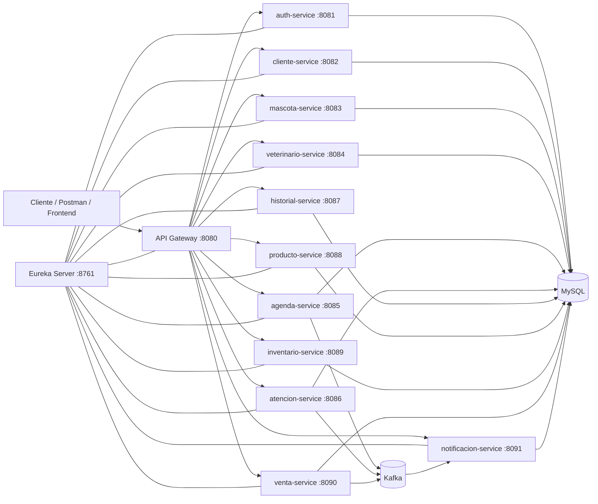

# VetControl Microservices

Plataforma backend basada en **microservicios Spring Boot** para la gestión de una clínica veterinaria con módulo de pet shop. El sistema centraliza la administración de clientes, mascotas, veterinarios, agenda, atenciones clínicas, historial, productos, inventario, ventas, autenticación y notificaciones.

Este repositorio está preparado como proyecto académico/profesional para demostrar arquitectura distribuida, separación de responsabilidades, comunicación entre servicios, seguridad con JWT y uso de infraestructura local con Docker.

---

## Tabla de contenidos

- [Objetivo del proyecto](#objetivo-del-proyecto)
- [Arquitectura general](#arquitectura-general)
- [Tecnologías utilizadas](#tecnologías-utilizadas)
- [Microservicios incluidos](#microservicios-incluidos)
- [Requisitos previos](#requisitos-previos)
- [Configuración inicial](#configuración-inicial)
- [Ejecución del proyecto](#ejecución-del-proyecto)
- [Credenciales de prueba](#credenciales-de-prueba)
- [Rutas principales por API Gateway](#rutas-principales-por-api-gateway)
- [Flujo recomendado para demostración](#flujo-recomendado-para-demostración)
- [Swagger / OpenAPI](#swagger--openapi)
- [Colección Postman](#colección-postman)
- [Estructura del repositorio](#estructura-del-repositorio)
- [Solución de problemas frecuentes](#solución-de-problemas-frecuentes)

---

## Objetivo del proyecto

**VetControl** busca representar una solución backend escalable para una clínica veterinaria y tienda de productos para mascotas. Su diseño se basa en microservicios independientes, donde cada módulo tiene su propia responsabilidad, base de datos lógica y API REST.

El proyecto permite demostrar:

- Separación de responsabilidades por dominio.
- Uso de **API Gateway** como punto único de entrada.
- Descubrimiento de servicios con **Eureka Server**.
- Autenticación y autorización mediante **JWT**.
- Comunicación sincrónica entre servicios con **OpenFeign**.
- Comunicación asincrónica por eventos con **Apache Kafka**.
- Persistencia con **Spring Data JPA**, **MySQL** y migraciones con **Flyway**.
- Documentación de endpoints mediante **Swagger/OpenAPI**.

---

## Arquitectura general



### Comunicación entre servicios

- **Sincrónica:** mediante REST y OpenFeign para validaciones entre servicios.
  - `mascota-service` valida clientes.
  - `agenda-service` valida mascotas y veterinarios.
  - `venta-service` valida clientes, productos e inventario.
- **Asincrónica:** mediante Kafka para eventos de negocio.
  - Creación de citas.
  - Registro de atenciones.
  - Registro de ventas.
  - Generación de notificaciones.

---

## Tecnologías utilizadas

| Categoría | Tecnología |
|---|---|
| Lenguaje | Java 17 |
| Framework principal | Spring Boot 3.2.5 |
| Microservicios | Spring Cloud 2023.0.1 |
| API Gateway | Spring Cloud Gateway |
| Service Discovery | Netflix Eureka |
| Seguridad | Spring Security, JWT, BCrypt, RBAC |
| Persistencia | Spring Data JPA / Hibernate |
| Base de datos | MySQL 8 |
| Migraciones | Flyway |
| Comunicación REST | OpenFeign |
| Mensajería | Apache Kafka + Zookeeper |
| Documentación API | Springdoc OpenAPI / Swagger UI |
| Build | Maven |
| Contenedores | Docker Compose |
| Pruebas manuales | Postman |

---

## Microservicios incluidos

| Microservicio | Puerto | Responsabilidad principal |
|---|---:|---|
| `eureka-server` | 8761 | Registro y descubrimiento de microservicios |
| `api-gateway` | 8080 | Entrada única a las APIs del sistema |
| `auth-service` | 8081 | Login, usuarios, roles y generación de JWT |
| `cliente-service` | 8082 | Gestión de clientes o dueños de mascotas |
| `mascota-service` | 8083 | Gestión de mascotas/pacientes |
| `veterinario-service` | 8084 | Gestión de veterinarios y especialidades |
| `agenda-service` | 8085 | Gestión de citas y agenda veterinaria |
| `atencion-service` | 8086 | Registro de atenciones veterinarias |
| `historial-service` | 8087 | Historial clínico de mascotas |
| `producto-service` | 8088 | Productos del pet shop |
| `inventario-service` | 8089 | Stock, validación y descuento de inventario |
| `venta-service` | 8090 | Ventas y detalle de productos vendidos |
| `notificacion-service` | 8091 | Notificaciones generadas por eventos Kafka |

---

## Requisitos previos

Antes de ejecutar el proyecto, se recomienda tener instalado:

- **Java JDK 17**
- **Maven 3.9 o superior**
- **Docker Desktop**
- **Postman**
- **IntelliJ IDEA** o IDE compatible con Spring Boot
- Puerto `3306`, `8761`, `8080` a `8091`, `9092` y `2181` disponibles

---

## Configuración inicial

### 1. Clonar o abrir el proyecto

```bash
git clone <url-del-repositorio>
cd vetcontrol-microservices
```

Si el proyecto fue descargado como ZIP, solo descomprimir y abrir la carpeta raíz en IntelliJ IDEA.

### 2. Levantar infraestructura local

El archivo `docker-compose.yml` levanta MySQL, Kafka y Zookeeper.

```bash
docker compose up -d
```

Esto crea la infraestructura base:

| Servicio | Puerto |
|---|---:|
| MySQL | 3306 |
| Zookeeper | 2181 |
| Kafka | 9092 |

Además, el script `infra/mysql/init/00-create-databases.sql` crea las bases lógicas necesarias:

- `vetcontrol_auth`
- `vetcontrol_clientes`
- `vetcontrol_mascotas`
- `vetcontrol_veterinarios`
- `vetcontrol_agenda`
- `vetcontrol_atenciones`
- `vetcontrol_historial`
- `vetcontrol_productos`
- `vetcontrol_inventario`
- `vetcontrol_ventas`
- `vetcontrol_notificaciones`

### 3. Configurar variable JWT

Algunos servicios leen el secreto JWT desde la variable de entorno `JWT_SECRET`.

#### Windows PowerShell

```powershell
$env:JWT_SECRET="vetcontrol-secret-key-2026-vetcontrol-secret-key-2026"
```

#### Linux / macOS / Git Bash

```bash
export JWT_SECRET=vetcontrol-secret-key-2026-vetcontrol-secret-key-2026
```

> Importante: define esta variable antes de ejecutar los microservicios desde la terminal o configura la variable en IntelliJ IDEA dentro de cada configuración de ejecución.

---

## Ejecución del proyecto

### Opción A: ejecutar desde IntelliJ IDEA

Abrir el proyecto raíz y ejecutar los módulos en este orden:

1. `eureka-server`
2. `api-gateway`
3. `auth-service`
4. Servicios de dominio:
   - `cliente-service`
   - `mascota-service`
   - `veterinario-service`
   - `agenda-service`
   - `atencion-service`
   - `historial-service`
   - `producto-service`
   - `inventario-service`
   - `venta-service`
   - `notificacion-service`

Cuando los servicios estén arriba, se puede validar Eureka en:

```http
http://localhost:8761
```

### Opción B: compilar todo el proyecto

```bash
mvn clean install -DskipTests
```

### Opción C: ejecutar un módulo por Maven

Ejemplo:

```bash
mvn -pl eureka-server spring-boot:run
```

Otro ejemplo:

```bash
mvn -pl api-gateway spring-boot:run
```

---

## Credenciales de prueba

El `auth-service` crea usuarios iniciales automáticamente al iniciar.

| Usuario | Contraseña | Rol |
|---|---|---|
| `admin` | `admin123` | `ADMIN` |
| `recepcion` | `recepcion123` | `RECEPCIONISTA` |
| `vet` | `vet123` | `VETERINARIO` |

---

## Login

Todas las pruebas deben iniciar solicitando un token JWT.

```http
POST http://localhost:8080/api/v1/auth/login
Content-Type: application/json
```

```json
{
  "username": "admin",
  "password": "admin123"
}
```

Respuesta esperada:

```json
{
  "token": "TOKEN_GENERADO",
  "tokenType": "Bearer",
  "username": "admin",
  "role": "ADMIN"
}
```

Para consumir endpoints protegidos, agregar el token en Postman:

```http
Authorization: Bearer TOKEN_GENERADO
```

---

## Rutas principales por API Gateway

El API Gateway se ejecuta en el puerto `8080` y redirige las solicitudes hacia cada microservicio.

| Recurso | Método | Ruta |
|---|---|---|
| Auth | POST | `/api/v1/auth/login` |
| Usuarios | GET / POST | `/api/v1/users` |
| Clientes | GET / POST | `/api/v1/clientes` |
| Clientes por ID | GET / PUT / DELETE | `/api/v1/clientes/{id}` |
| Mascotas | GET / POST | `/api/v1/mascotas` |
| Mascotas por cliente | GET | `/api/v1/mascotas/cliente/{clienteId}` |
| Veterinarios | GET / POST | `/api/v1/veterinarios` |
| Veterinarios por especialidad | GET | `/api/v1/veterinarios/especialidad?nombre={especialidad}` |
| Citas | GET / POST | `/api/v1/citas` |
| Citas por fecha | GET | `/api/v1/citas/fecha/{fecha}` |
| Atenciones | GET / POST | `/api/v1/atenciones` |
| Atenciones por mascota | GET | `/api/v1/atenciones/mascotas/{mascotaId}` |
| Historiales | GET / POST | `/api/v1/historiales` |
| Historial por mascota | GET | `/api/v1/historiales/mascotas/{mascotaId}` |
| Productos | GET / POST | `/api/v1/productos` |
| Productos por categoría | GET | `/api/v1/productos/categoria/{categoria}` |
| Inventario | GET / POST | `/api/v1/inventario` |
| Inventario por producto | GET | `/api/v1/inventario/productos/{productoId}` |
| Validar stock | GET | `/api/v1/inventario/productos/{productoId}/validar/{cantidad}` |
| Descontar stock | PUT | `/api/v1/inventario/productos/{productoId}/descontar/{cantidad}` |
| Bajo stock | GET | `/api/v1/inventario/bajo-stock` |
| Ventas | GET / POST | `/api/v1/ventas` |
| Ventas por cliente | GET | `/api/v1/ventas/clientes/{clienteId}` |
| Notificaciones | GET / POST | `/api/v1/notificaciones` |

---

## Ejemplos rápidos de uso

### Crear cliente

```http
POST http://localhost:8080/api/v1/clientes
Authorization: Bearer TOKEN_GENERADO
Content-Type: application/json
```

```json
{
  "rut": "12345678-9",
  "nombre": "Pedro Riquelme",
  "telefono": "+56912345678",
  "correo": "pedro@example.com",
  "direccion": "Santiago"
}
```

### Crear mascota

```http
POST http://localhost:8080/api/v1/mascotas
Authorization: Bearer TOKEN_GENERADO
Content-Type: application/json
```

```json
{
  "clienteId": 1,
  "nombre": "Rocky",
  "especie": "Perro",
  "raza": "Mestizo",
  "edad": 3,
  "sexo": "Macho",
  "peso": 12.5,
  "microchip": "CHIP-123"
}
```

### Crear veterinario

```http
POST http://localhost:8080/api/v1/veterinarios
Authorization: Bearer TOKEN_GENERADO
Content-Type: application/json
```

```json
{
  "rut": "11111111-1",
  "nombre": "Dra. Camila Torres",
  "especialidad": "Medicina interna",
  "correo": "camila.torres@vetcontrol.cl"
}
```

### Agendar cita

```http
POST http://localhost:8080/api/v1/citas
Authorization: Bearer TOKEN_GENERADO
Content-Type: application/json
```

```json
{
  "mascotaId": 1,
  "veterinarioId": 1,
  "fecha": "2026-06-01",
  "hora": "10:30:00",
  "motivo": "Consulta general"
}
```

### Registrar atención

```http
POST http://localhost:8080/api/v1/atenciones
Authorization: Bearer TOKEN_GENERADO
Content-Type: application/json
```

```json
{
  "citaId": 1,
  "mascotaId": 1,
  "veterinarioId": 1,
  "fechaAtencion": "2026-06-01T10:45:00",
  "diagnostico": "Control general sin hallazgos graves",
  "tratamiento": "Vitaminas y control en 30 días",
  "observaciones": "Paciente estable"
}
```

### Crear producto

```http
POST http://localhost:8080/api/v1/productos
Authorization: Bearer TOKEN_GENERADO
Content-Type: application/json
```

```json
{
  "nombre": "Alimento premium perro adulto",
  "categoria": "Alimentos",
  "precio": 24990,
  "restringido": false
}
```

### Crear inventario

```http
POST http://localhost:8080/api/v1/inventario
Authorization: Bearer TOKEN_GENERADO
Content-Type: application/json
```

```json
{
  "productoId": 1,
  "stockActual": 20,
  "stockMinimo": 5
}
```

### Registrar venta

```http
POST http://localhost:8080/api/v1/ventas
Authorization: Bearer TOKEN_GENERADO
Content-Type: application/json
```

```json
{
  "clienteId": 1,
  "medioPago": "DEBITO",
  "detalles": [
    {
      "productoId": 1,
      "cantidad": 2
    }
  ]
}
```

---

## Flujo recomendado para demostración

Para presentar el sistema de forma ordenada, se recomienda seguir este flujo:

1. Levantar Docker con MySQL, Kafka y Zookeeper.
2. Iniciar Eureka Server y revisar `http://localhost:8761`.
3. Iniciar API Gateway.
4. Iniciar los microservicios principales.
5. Realizar login con usuario `admin`.
6. Copiar el token JWT en Postman.
7. Crear un cliente.
8. Crear una mascota asociada al cliente.
9. Crear un veterinario.
10. Agendar una cita.
11. Registrar una atención veterinaria.
12. Crear un producto del pet shop.
13. Crear inventario para ese producto.
14. Registrar una venta.
15. Revisar notificaciones generadas por eventos Kafka.

---

## Swagger / OpenAPI

Cada microservicio expone su propia documentación Swagger.

Ejemplos:

```http
http://localhost:8081/swagger-ui.html
http://localhost:8082/swagger-ui.html
http://localhost:8083/swagger-ui.html
http://localhost:8088/swagger-ui.html
```

También puede usarse la ruta alternativa:

```http
http://localhost:8082/swagger-ui/index.html
```

---

## Colección Postman

El repositorio incluye una colección lista para pruebas manuales:

```text
VetControl.postman_collection.json
```

También existen ejemplos documentados en:

```text
docs/postman-ejemplos.md
```

Recomendación de uso en Postman:

1. Importar la colección.
2. Ejecutar login.
3. Guardar el token JWT.
4. Agregar el token en la pestaña **Authorization** como `Bearer Token`.
5. Probar los endpoints por flujo funcional.

---

## Estructura del repositorio

```text
vetcontrol-microservices/
├── api-gateway/
├── auth-service/
├── cliente-service/
├── mascota-service/
├── veterinario-service/
├── agenda-service/
├── atencion-service/
├── historial-service/
├── producto-service/
├── inventario-service/
├── venta-service/
├── notificacion-service/
├── eureka-server/
├── infra/
│   └── mysql/
│       └── init/
├── docs/
│   ├── arquitectura.md
│   └── postman-ejemplos.md
├── docker-compose.yml
├── VetControl.postman_collection.json
├── pom.xml
└── README.md
```

---

## Bases de datos

El proyecto usa un enfoque de **base de datos por servicio**, separando los esquemas en MySQL. Esto evita que los microservicios compartan tablas directamente y mantiene la independencia de cada dominio.

La configuración local usa un solo contenedor MySQL con varios esquemas para facilitar el desarrollo y las pruebas académicas. En un entorno productivo, cada servicio podría tener una base o instancia independiente.

---

## Seguridad

El sistema usa:

- Login centralizado en `auth-service`.
- Generación de token JWT.
- Validación del token en los microservicios.
- Contraseñas cifradas con BCrypt.
- Roles principales:
  - `ADMIN`
  - `RECEPCIONISTA`
  - `VETERINARIO`

---

## Eventos Kafka

Los servicios pueden publicar eventos de negocio para desacoplar procesos secundarios, especialmente notificaciones.

Eventos principales considerados:

- `cita-creada`
- `atencion-registrada`
- `venta-creada`

El `notificacion-service` consume eventos y registra notificaciones asociadas a operaciones importantes del sistema.

---

## Solución de problemas frecuentes

### 1. Error de conexión a MySQL

Verificar que Docker esté levantado:

```bash
docker compose ps
```

Si MySQL no está iniciado:

```bash
docker compose up -d
```

### 2. Error por variable `JWT_SECRET`

Definir la variable antes de iniciar los servicios:

```powershell
$env:JWT_SECRET="vetcontrol-secret-key-2026-vetcontrol-secret-key-2026"
```

O configurarla en IntelliJ IDEA en:

```text
Run > Edit Configurations > Environment variables
```

### 3. Servicios no aparecen en Eureka

Revisar que `eureka-server` esté iniciado antes de los demás servicios.

Panel de Eureka:

```http
http://localhost:8761
```

### 4. API Gateway no responde

Verificar que:

- `api-gateway` esté iniciado.
- El servicio destino esté registrado en Eureka.
- La ruta usada comience con `/api/v1/...`.
- El token JWT sea válido cuando el endpoint lo requiera.

### 5. Kafka no recibe eventos

Verificar que Kafka y Zookeeper estén activos:

```bash
docker compose ps
```

También confirmar que los servicios que publican o consumen eventos estén iniciados.

### 6. Puerto ocupado

Si un puerto está ocupado, cerrar el proceso que lo usa o cambiar el puerto en el archivo:

```text
src/main/resources/application.yml
```

---

## Documentación adicional

- `docs/arquitectura.md`: explicación general de la arquitectura.
- `docs/postman-ejemplos.md`: ejemplos de payloads para pruebas.
- `VetControl.postman_collection.json`: colección importable en Postman.

---

## Estado del proyecto

Proyecto funcional como base académica para laboratorio, presentación o evaluación de arquitectura de microservicios. Puede ser extendido con frontend, pruebas automatizadas, observabilidad, Dockerfile por servicio y despliegue en nube.

---

## Autoría

Proyecto desarrollado con fines académicos para demostrar buenas prácticas de arquitectura backend, microservicios, seguridad, persistencia y comunicación entre servicios.
